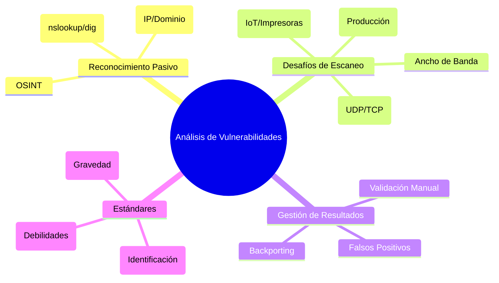
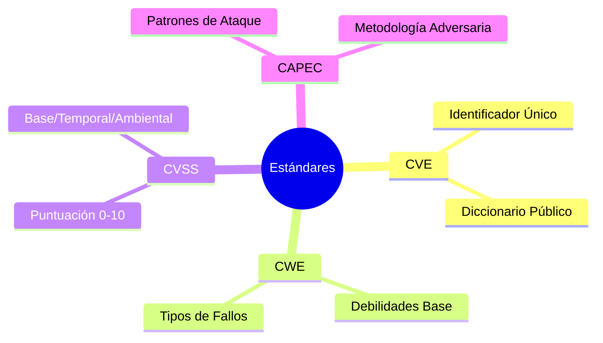

# 📚 Resumen de Combate: Tema 3 - Reconocimiento y Vulnerabilidades

Este documento sintetiza los conceptos fundamentales de la recopilación de información y el análisis de vulnerabilidades, diseñado para una consulta rápida y efectiva.

---

## 🗺️ Mapa Mental: Reconocimiento y Vulnerabilidades

---

## 1. 🔭 Reconocimiento Pasivo (Footprinting)

El reconocimiento pasivo es el arte de obtener información sin interactuar directamente con el objetivo, evitando generar alertas en los logs perimetrales.

### Herramientas Clave de DNS:
*   **Nslookup:** Versátil, disponible en Windows/Linux. Ideal para consultas rápidas de registros A, AAAA, MX y NS.
*   **Dig (Domain Information Groper):** La herramienta preferida por expertos. Proporciona detalles técnicos sobre tiempos de respuesta, cabeceras DNS y secciones adicionales.
*   **Whois:** Consulta bases de datos de registro de dominios. Permite identificar la organización propietaria, contactos técnicos y rangos de direcciones IP (NetRanges).

---

## 2. 🛡️ Análisis de Vulnerabilidades (Vulnerability Scanning)

El escaneo automatizado vincula la información del reconocimiento con bases de datos de fallos conocidos.

### ⚠️ Los 6 Desafíos Críticos del Escaneo:
1.  **Timing (El Momento):** Nunca escanees en horas pico de producción. El ruido y la congestión pueden tumbar servicios críticos.
2.  **Protocolos:** No te limites a TCP. Muchos servicios críticos (DNS, SNMP) corren sobre **UDP** y suelen ser olvidados.
3.  **Topología:** Ubica el escáner lo más cerca posible del objetivo (idealmente en la misma subred/DMZ) para evitar que los Firewalls distorsionen los resultados.
4.  **Ancho de Banda:** Ajusta la concurrencia de hilos para no saturar enlaces WAN o VPN.
5.  **Query Throttling:** Ralentiza el tráfico de escaneo para sistemas sensibles.
6.  **Sistemas Frágiles:** Cuidado con impresoras, cámaras IoT y PLCs industriales; pueden bloquearse con un simple escaneo de puertos agresivo.

---

## 3. 🧪 Gestión de Resultados: Falsos Positivos

Un informe lleno de falsos positivos destruye la confianza del cliente y hace perder el tiempo a los equipos de IT.

### Cómo Validar Hallazgos:
*   **Revisión Manual:** Conéctate directamente al puerto y verifica la versión (`banner grabbing`).
*   **Backporting:** Ten en cuenta que distribuciones como Red Hat parchean versiones antiguas sin cambiar el número de versión (lo que engaña a los escáneres).
*   **Contexto:** ¿La vulnerabilidad requiere una configuración específica que no está presente?

---

## 📏 4. Estándares y Clasificación (El ABC del Pentester)

### 🗺️ Mapa Mental: Estándares de Seguridad

Para priorizar las acciones, utilizamos estándares internacionales:

*   **CVE (Common Vulnerabilities and Exposures):** Diccionario de vulnerabilidades identificadas de forma única (Ej: CVE-2023-XXXX).
*   **CWE (Common Weakness Enumeration):** Clasifica el "tipo" de debilidad subyacente (ej: desbordamiento de búfer, inyección SQL).
*   **CVSS (Common Vulnerability Scoring System):** Puntuación de 0 a 10.
    *   **Base Score:** Gravedad intrínseca (lo más importante).
    *   **Temporal Score:** Cómo cambia la amenaza con el tiempo (ej: ¿hay un exploit público?).
    *   **Environmental Score:** Impacto real en *tu* red específica.
*   **CAPEC:** Catálogo de patrones de ataque realizados por adversarios.

---

## 🌐 Fuentes de Inteligencia y Mitigación
*   **NIST NVD:** La base de datos nacional de vulnerabilidades.
*   **US-CERT / JPCERT:** Equipos de respuesta ante emergencias que publican alertas críticas.

---
> **Tip de Mentor:** "Un escáner te da datos, un analista te da seguridad." Valida siempre tus hallazgos antes de reportarlos.
