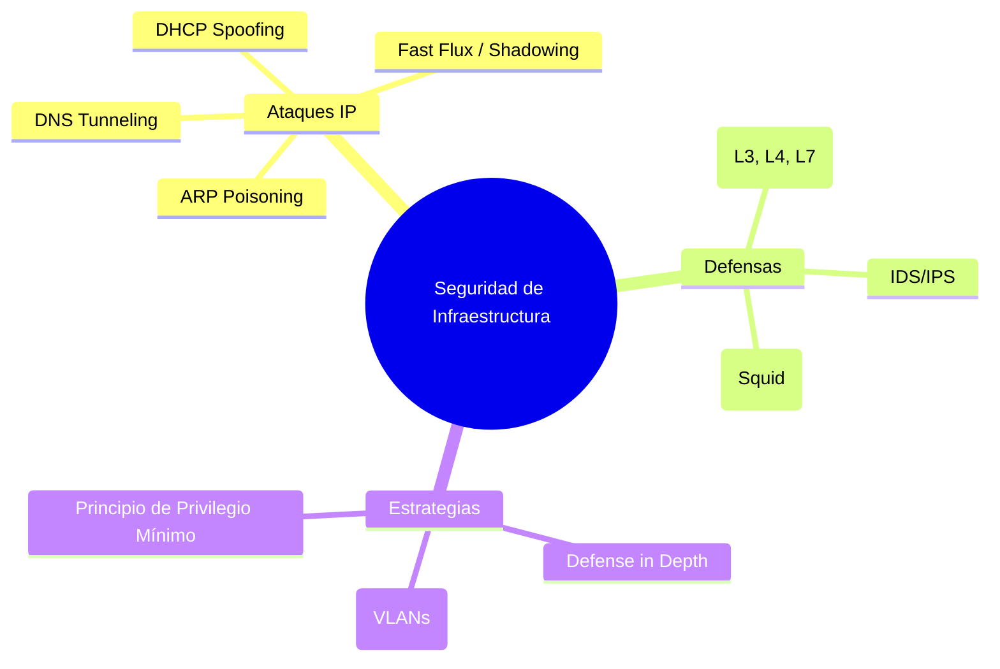
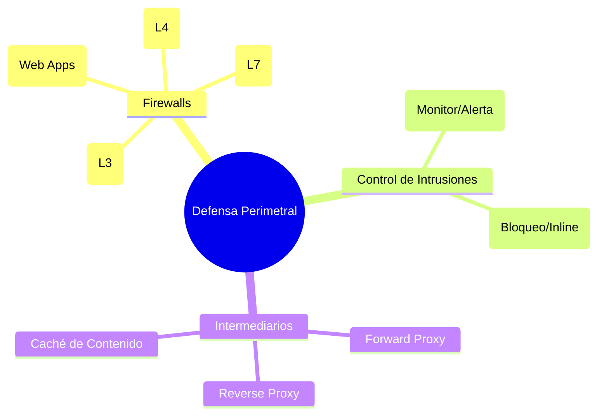

# 📚 Resumen de Combate: Tema 4 - Infraestructura y Defensa

Este resumen condensa las técnicas de ataque a servicios IP y las estrategias de defensa multicapa (Defense in Depth).

---

## 🗺️ Mapa Mental: Seguridad de Red e Infraestructura

---

## 1. 🌐 Ataques a la Infraestructura IP (Capa 2 y 3)

Los protocolos básicos (ARP, DHCP, DNS) no fueron diseñados con la seguridad en mente.

*   **ARP Poisoning:** Un atacante envía respuestas ARP falsas para asociar su MAC con la IP de la puerta de enlace, permitiendo ataques **Man-in-the-Middle (MiTM)**.
*   **DNS Tunneling:** Técnica sigilosa para exfiltrar datos encapsulando tráfico no-DNS dentro de consultas DNS. Muy difícil de detectar sin inspección profunda.
*   **Fast Flux:** Técnica de las botnets que cambia rápidamente las direcciones IP asociadas a un FQDN para evadir el bloqueo por IP.
*   **Domain Shadowing:** Los atacantes comprometen cuentas de registradores para crear miles de subdominios en dominios legítimos sin que el dueño se entere.

---

## 2. 🛡️ Murallas de Defensa: Firewalls

### 🗺️ Mapa Mental: Tipos de Seguridad Perimetral

No todos los firewalls son iguales. Un administrador senior debe saber diferenciarlos:

| Tipo | Operación | Capa OSI | Función Principal |
| :--- | :--- | :--- | :--- |
| **ACL Básica** | Estática | 3 (Red) | Permite/Deniega por IP de origen/destino. |
| **Stateful** | Con Estado | 4 (Transporte) | Recuerda conexiones abiertas; bloquea paquetes huérfanos. |
| **NGFW** | Aplicación | 7 (Aplicación) | Entiende el tráfico (ej: sabe si es Facebook o un SQLi). |
| **WAF** | Web | 7 (Aplicación) | Protege específicamente servidores web contra inyecciones SQL y XSS. |

---

## 🔍 3. IDS vs IPS: El Vigilante vs El Guardaespaldas

*   **IDS (Intrusion Detection System):** Monitoriza y alerta (**Pasivo**). Se coloca en un puerto "SPAN" o "Mirror". No afecta al rendimiento pero no detiene el ataque.
*   **IPS (Intrusion Prevention System):** Monitoriza y bloquea (**Activo**). Se coloca **Inline** (el tráfico pasa a través de él). Puede detener ataques en tiempo real pero introduce latencia.

---

## 🕸️ 4. Seguridad Web y Aplicaciones

El **OWASP Top 10** es la referencia estándar. Las técnicas más peligrosas tratadas son:
*   **Inyección (SQLi):** Comandos maliciosos en campos de formulario que manipulan la base de datos.
*   **XSS (Cross-Site Scripting):** Inyección de scripts en el navegador de la víctima.
*   **Broken Access Control:** Fallos que permiten a un usuario ver datos de otros.

---

## 🏠 5. Estrategia "Defense in Depth" (Defensa en Profundidad)

La seguridad no es una herramienta, es una estrategia. Se basa en capas:
1.  **Datos:** Cifrado (AES-256).
2.  **Aplicación:** OWASP, Validación de entradas.
3.  **Host:** Antivirus, EDR, Parches.
4.  **Red Interna:** Segmentación (VLANs), IDS.
5.  **Perímetro:** NGFW, Proxy, VPN.
6.  **Física:** Guardias, llaves, cámaras.

---
> **Tip de Mentor:** "La seguridad es tan fuerte como su eslabón más débil." En el Tema 4, aprendimos que ese eslabón suele ser el usuario (Ingeniería Social) o una configuración errónea en un servicio básico como DHCP.
